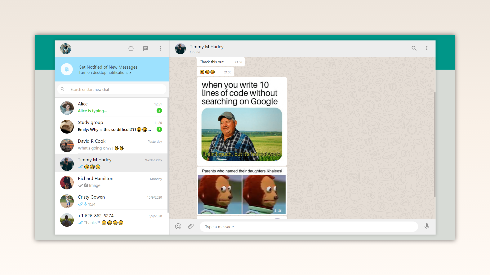

# WhatsApp web clone (UI)

This is a clone of WhatsApp web using HTML and CSS (Grid and Flexbox).

## Technologies

Technologies used:

- HTML
- CSS (Grid and Flexbox)

## License

Licensed under the [MIT License](LICENSE).
